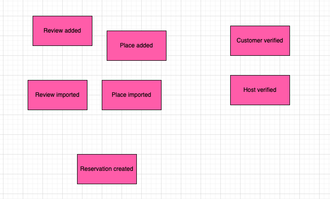
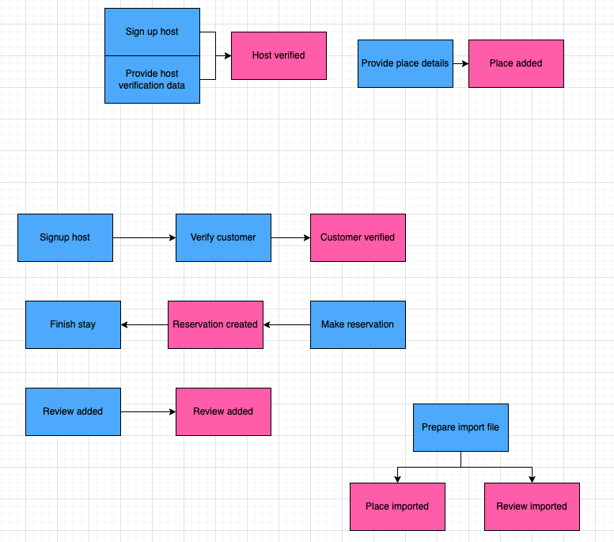
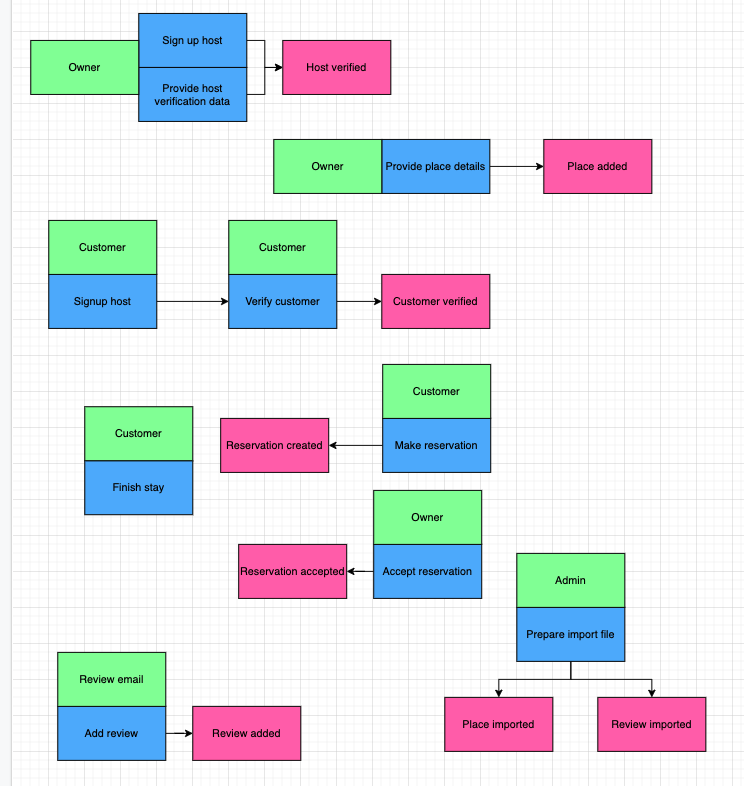
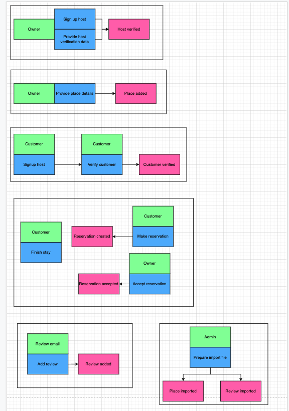

# A step by step process of Event Storming
## Below you can find separated steps of collection business processes

Workshop was guided by that [resource](https://www.boldare.com/blog/event-storming-guide/)

### Step 1 – domain events

### Step 2 – commands

### Step 3 – other triggers

### Step 4 – aggregates and bounded context
